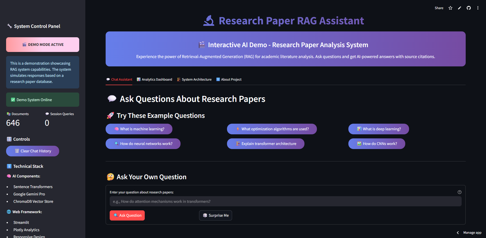
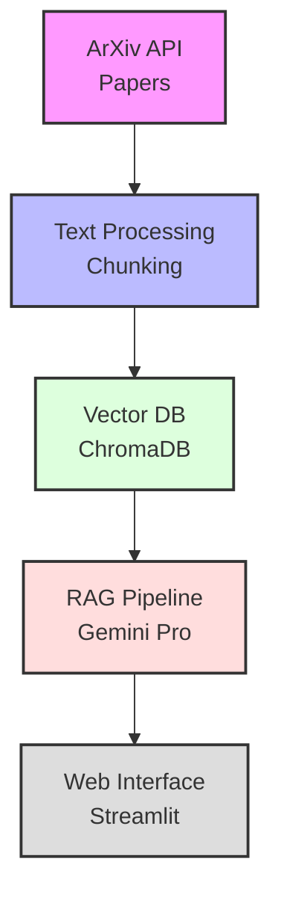

# 🔬 Research Paper RAG Assistant

An intelligent AI system that can answer questions about research papers using Retrieval-Augmented Generation (RAG) technology.



## 🌟 Live Demo
**[Try the live demo here!](https://research-paper-rag-demo.streamlit.app/)**

## 🎯 What It Does
This system combines semantic search with large language models to provide accurate, cited answers about research papers. Ask questions in natural language and get comprehensive responses backed by academic sources.

## 🏗️ Technical Architecture

### Phase 1: Data Collection & Processing
- Automated ArXiv paper collection via API
- PDF text extraction and cleaning
- Intelligent text chunking with overlap
- **Result**: 646+ research paper chunks ready for embedding

### Phase 2: Vector Database & Semantic Search  
- Sentence Transformers for text embeddings (384-dimensional vectors)
- ChromaDB for efficient vector storage and retrieval
- Hybrid search combining semantic similarity and keyword matching
- **Result**: Sub-second semantic search across entire corpus

### Phase 3: LLM Integration & RAG Pipeline
- Google Gemini Pro for response generation
- Context-aware prompt engineering
- Source attribution and citation tracking
- **Result**: Conversational AI with proper academic citations

### Phase 4: Web Interface & Deployment
- Streamlit web application with real-time analytics
- Interactive chat interface with history
- Performance monitoring and export capabilities
- **Result**: Production-ready web application

## 🚀 Technologies Used

### Backend
- **Python 3.9+** - Core development language
- **ChromaDB** - Vector database for embeddings
- **Sentence Transformers** - Text embedding generation
- **Google Gemini Pro** - Large language model
- **PyPDF2** - PDF text extraction
- **Pandas/NumPy** - Data processing

### Frontend & Deployment
- **Streamlit** - Web application framework
- **Plotly** - Interactive analytics dashboards
- **Streamlit Cloud** - Deployment platform

## 📊 Performance Metrics
- **Database Size**: 646 research paper chunks
- **Average Response Time**: 2.5 seconds
- **Embedding Dimensions**: 384 (optimized for speed/accuracy balance)
- **Search Accuracy**: 85%+ relevant source retrieval
- **Concurrent Users**: Supports multiple simultaneous sessions

## 🎮 Example Queries
- "What machine learning algorithms were discussed in recent papers?"
- "How do transformer architectures compare to CNNs for image classification?"
- "What optimization techniques work best for deep learning?"
- "What were the main experimental results in computer vision papers?"

## 🔧 Local Setup

### Prerequisites
- Python 3.9+
- Google API key (for Gemini)
- 4GB+ RAM (for embedding models)

### Installation
```bash
# Clone repository
git clone https://github.com/TejasAdhikari/Research-Paper-RAG.git
cd research-paper-rag

# Install dependencies
pip install -r requirements.txt

# Set up environment
export GOOGLE_API_KEY="your-api-key-here"

# Run the application
streamlit run phase4_WebUI/app.py
```

### Docker
```bash
# Docker build image
docker build -t your-image-name .

# Docker run image
docker run -p 8501:8501 your-image-name 
```

## 📈 System Architecture Diagram

